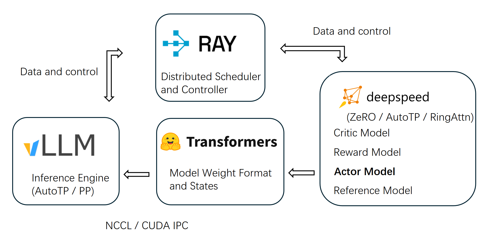

Welcome to OpenRLHF's documentation!
===================================

`OpenRLHF <https://github.com/OpenRLHF/OpenRLHF>`_ is the first easy-to-use, high-performance RLHF framework built on Ray, vLLM, ZeRO-3 and HuggingFace Transformers, designed to make RLHF training simple and accessible:

- **Distributed Architecture with Ray**  
  OpenRLHF leverages `Ray <https://github.com/ray-project/ray>`_ for efficient distributed scheduling. It separates the Actor, Reward, Reference, and Critic models across different GPUs, enabling scalable training for models up to 70B parameters.  
  It also supports **Hybrid Engine** scheduling, allowing all models and vLLM engines to share GPU resources—minimizing idle time and maximizing GPU utilization.

- **vLLM Inference Acceleration + AutoTP**  
  RLHF training spends 80% of the time on the sample generation stage. Powered by `vLLM <https://github.com/vllm-project/vllm>`_ and Auto Tensor Parallelism (AutoTP), OpenRLHF delivers high-throughput, memory-efficient samples generation. Native integration with HuggingFace Transformers ensures seamless and fast generation, making it the fastest RLHF framework available.

- **Memory-Efficient Training with ZeRO-3 / AutoTP**  
  Built on `DeepSpeed's <https://github.com/deepspeedai/DeepSpeed>`_ ZeRO-3, `deepcompile <https://github.com/deepspeedai/DeepSpeed/blob/master/blogs/deepcompile/README.md>`_ and `AutoTP <https://github.com/deepspeedai/DeepSpeed/blob/master/blogs/huggingface-tp/README.md>`_, OpenRLHF enables large model training without heavyweight frameworks. It works directly with HuggingFace for easy loading and fine-tuning of pretrained models.

- **Optimized PPO Implementation**  
  Incorporates advanced PPO tricks inspired by practical guides and community best practices, enhancing training stability and reward quality in RLHF workflows. Referencing `Zhihu <https://zhuanlan.zhihu.com/p/622134699>`_ and `Advanced Tricks for Training Large Language Models with Proximal Policy Optimization <https://hijkzzz.notion.site/rlhf-implementation-tricks?v=158d9a33ecc98132bf9e000c39227361>`_.

For more technical details, see our `slides <https://docs.google.com/presentation/d/1JRhB1d7csofx0PIZBmfyBdMluxNd5JLPpUHrrvVhGnk/edit?usp=sharing>`_ and `technical report <https://arxiv.org/abs/2405.11143>`_ .

Check out the :doc:`quick_start` section for further information, including
how to :ref:`installation` the project.

.. note::

   This project is under active development.

Contents
--------

.. toctree::

   quick_start
   rl
   non_rl
   hybrid_engine
   async_rl
   performance
   multi-node
   remote_rm
   checkpoint
   sequence_parallelism
