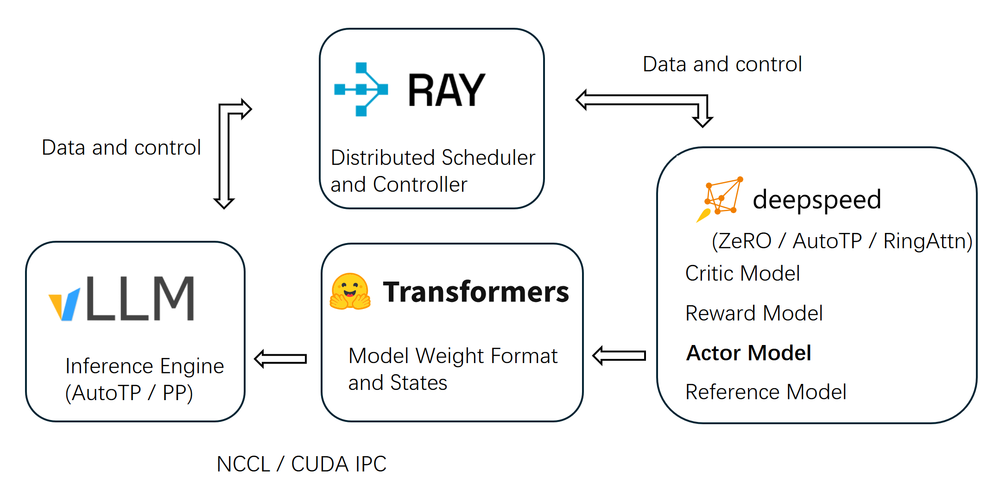

Welcome to OpenRLHF's documentation!
====================================

OpenRLHF is a high-performance RLHF framework built on **Ray + vLLM** with a **unified agent-based execution paradigm**. Its core idea is to decouple the execution mode (single-turn / multi-turn) from the RL algorithm (PPO, REINFORCE++, GRPO, RLOO, ...), so any algorithm can be combined with any mode through a consistent token-in-token-out pipeline.

Start here
----------

- New users: :doc:`quick_start` — installation and your first training run.
- Mental model: :doc:`agent_paradigm` and :doc:`architecture`.
- Something broke: :doc:`troubleshooting`.

Quick Links
-----------

- **Getting Started**: :doc:`quick_start`
- **Core Concepts**: :doc:`agent_paradigm` | :doc:`architecture`
- **Training Guides**: :doc:`agent_training` (RM, RL, single/multi-turn, VLM) | :doc:`non_rl` (SFT, DPO) | :doc:`common_options`
- **Scaling & Ops**: :doc:`hybrid_engine` | :doc:`performance` | :doc:`checkpoint` | :doc:`sequence_parallelism` | :doc:`multi-node`

Resources
---------

- `GitHub Repository <https://github.com/OpenRLHF/OpenRLHF>`_
- `Technical Report <https://www.researchgate.net/publication/393414548_OpenRLHF_An_Easy-to-use_Scalable_and_High-performance_RLHF_Framework>`_
- `Slides <https://docs.google.com/presentation/d/1JRhB1d7csofx0PIZBmfyBdMluxNd5JLPpUHrrvVhGnk/edit?usp=sharing>`_

.. note::

   This project is under active development.

Contents
--------

.. toctree::
   :maxdepth: 2
   :caption: Getting Started

   quick_start

.. toctree::
   :maxdepth: 2
   :caption: Core Concepts

   agent_paradigm
   architecture

.. toctree::
   :maxdepth: 2
   :caption: Training Guides

   agent_training
   non_rl
   common_options

.. toctree::
   :maxdepth: 2
   :caption: Scaling & Operations

   hybrid_engine
   performance
   checkpoint
   sequence_parallelism
   multi-node
   nvidia_docker
   troubleshooting
